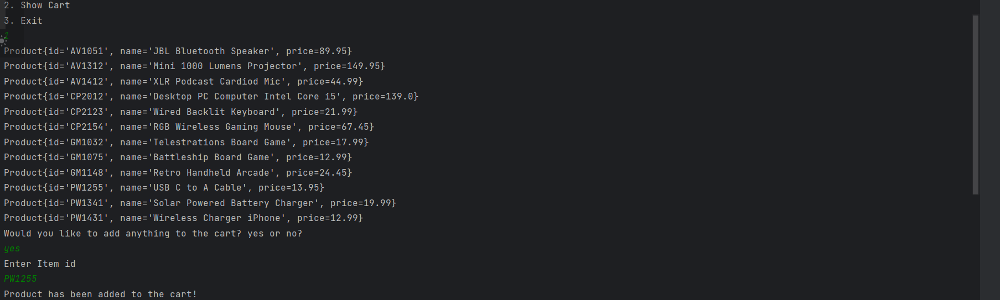
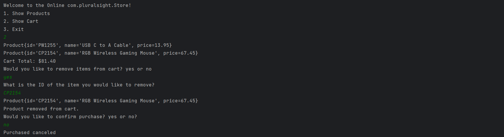
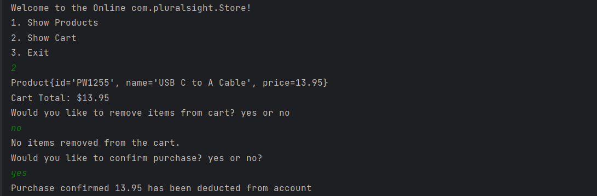

# Devin's Online Store

## Description of the Project
My online store is an application that allows users to shop online to find various products and purchase them with ease. 
One of the main features of my application is that users have a constant reminder of the total cost of their cart and items, as well as the ability to add and remove items from the cart.

## User Stories

-As an owner I would like to be able to view all the inventory with the push of a button. This will make it easier for me to shop and see everything together.

-As a user I would like to be able to see all the product information together easily and displayed. This will make it easy on the user to know what they are looking at.

-As a user I would like to be able to add items to my cart once I have had the ability to look at all the products. This will allow me to view and shop at the same time.

-As the user I would like all the items I want to be stored in one area, so I can have access to it.

-As a user I would like to be able to see all the items I have added to my cart.

-As a user I would like to be able to remove items from cart too if I change my mind on it.

-As the user I would like to be able to search products by the Id just to make it easier to search.

-As a user I would like to see the total cost of all the things I would like to buy to make it easier to budget.

-As the owner I would like to ask user if they would like to confirm the purchase, so no accidental purchases are made.

## Setup

First step would be showing all products which can be down by entering 1
Second step would to select if you would like to add an item to the cart then entering the product id number
Third step would be to show cart in order to begin check out
here you will be prompted to remove items if you would like 
if no items are removed purchase will be continued 

### Prerequisites

- IntelliJ IDEA: Ensure you have IntelliJ IDEA installed, which you can download from [here](https://www.jetbrains.com/idea/download/).
- Java SDK: Make sure Java SDK is installed and configured in IntelliJ.

### Running the Application in IntelliJ

Follow these steps to get your application running within IntelliJ IDEA:

1. Open IntelliJ IDEA.
2. Select "Open" and navigate to the directory where you cloned or downloaded the project.
3. After the project opens, wait for IntelliJ to index the files and set up the project.
4. Find the main class with the `public static void main(String[] args)` method.
5. Right-click on the file and select 'Run 'YourMainClassName.main()'' to start the application.

## Technologies Used

- IntelliJ IDEA Community Edition 2022.3.2
- Java 17

## Demo

Include screenshots or GIFs that show your application in action. Use tools like [Giphy Capture](https://giphy.com/apps/giphycapture) to record a GIF of your application.
Added item to cart
****
Removed item from cart 

Confirmed purchase

## Future Work

This workshop caused me so much stress I would rather not think about it for a while.
## Resources

- https://www.w3schools.com/java/java_ref_arraylist.asp
- https://github.com/RayMaroun

## Team Members
Cameron recommend that I should make a confirm purchase method instead of adding the scanner.
## Thanks

- Thank you to Raymond for continuous support and guidance.
- Thanks to Cameron for answering various questions I had.
